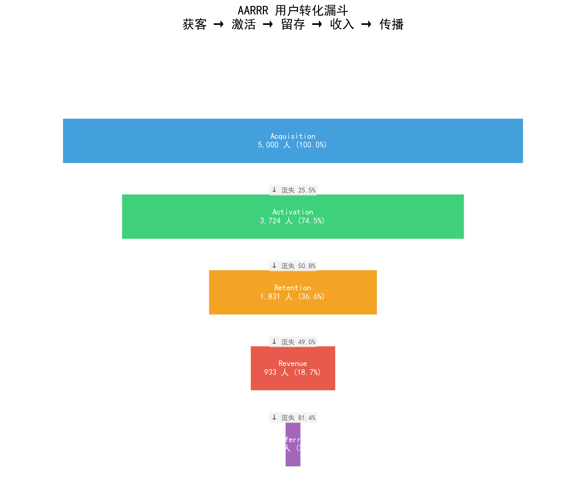
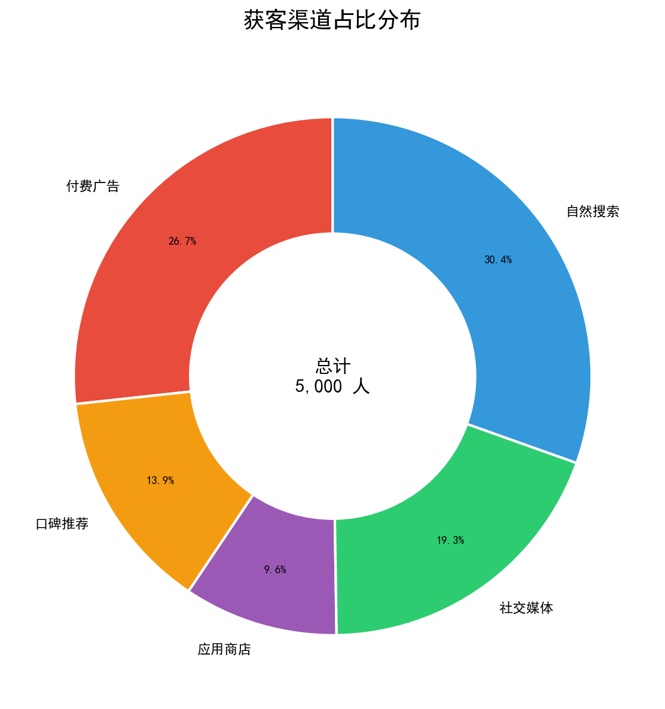
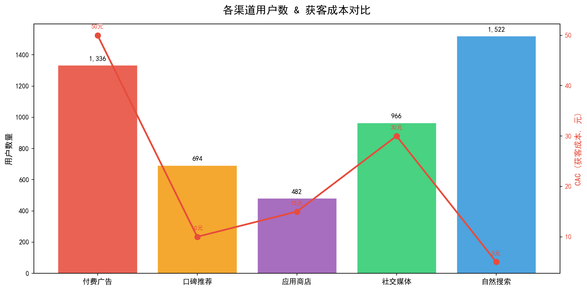
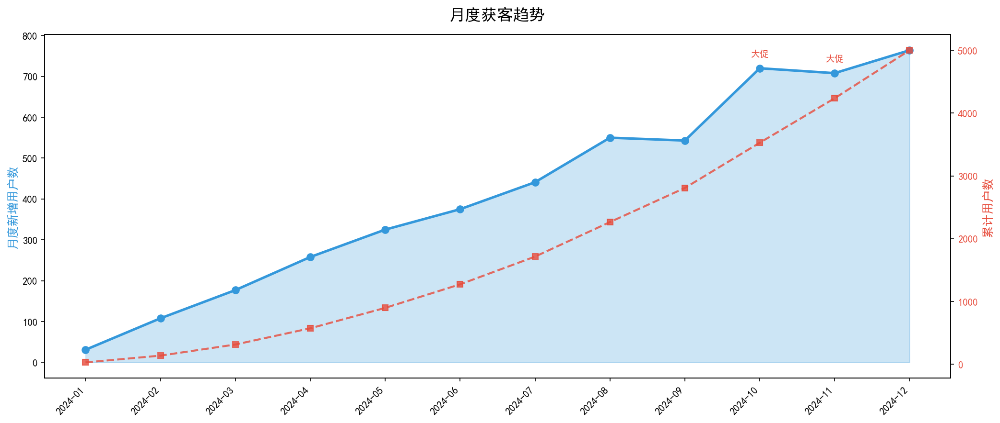
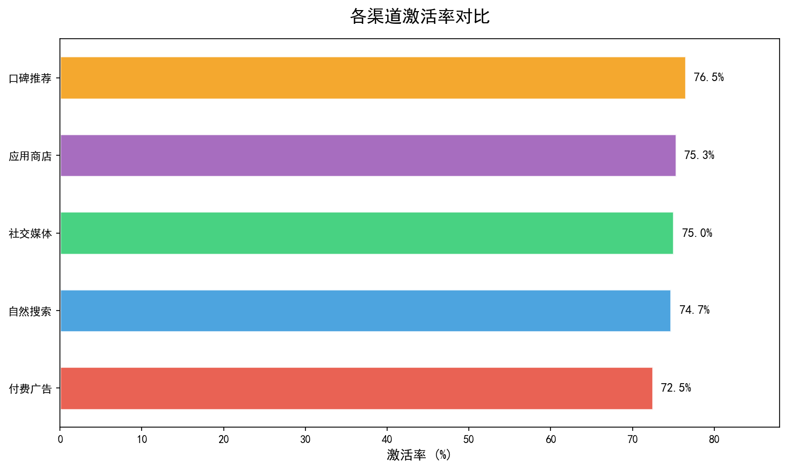
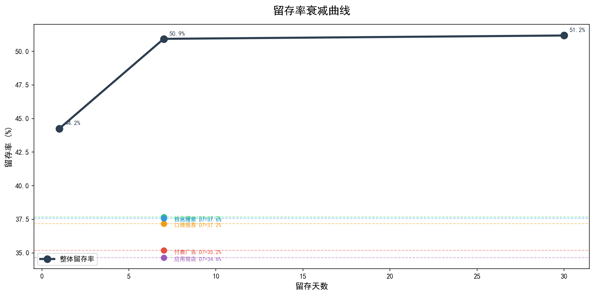
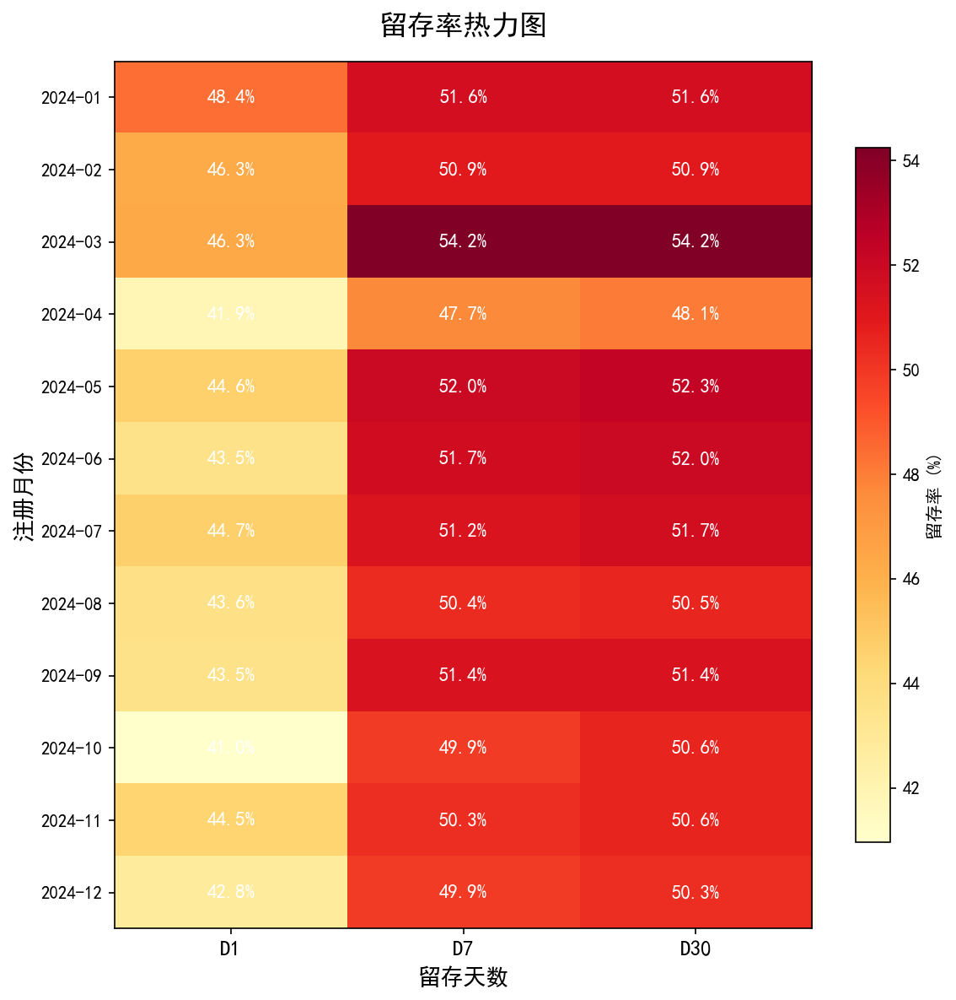
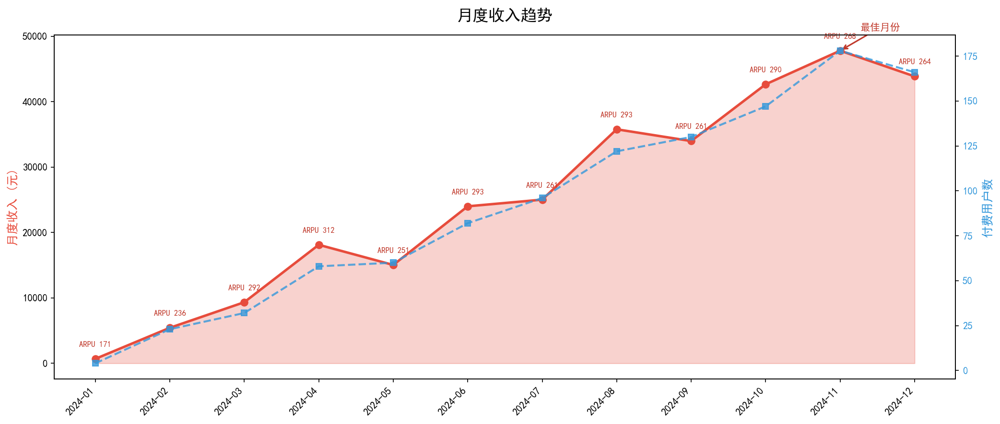
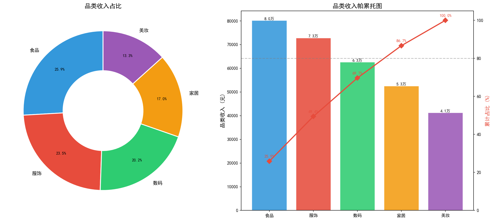
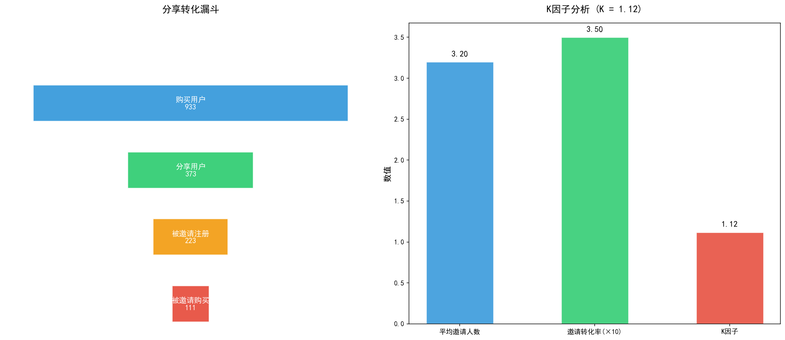

# AARRR 用户增长海盗指标分析报告

> **分析框架**: AARRR 海盗指标模型  
> **分析日期**: 2026-05-16  
> **数据规模**: 总用户 5000 人  
> **分析方法**: 漏斗分析 + 同期群分析 + 渠道归因

## 一、分析背景与目的

### 1.1 业务背景

用户增长是互联网产品的核心命题。AARRR 海盗指标模型将用户生命周期拆解为五个环节，
帮助我们系统性定位增长瓶颈。对于电商/App平台而言，用户从「看到广告」到「推荐好友」，
每一步都存在转化损失，识别并修复这些断点是增长的关键。

### 1.2 分析目的

| 环节 | 核心问题 | 关键指标 |
|------|----------|----------|
| Acquisition 获客 | 用户从哪里来？ | 渠道分布、CAC |
| Activation 激活 | 用户体验到Aha Moment了吗？ | 激活率 |
| Retention 留存 | 用户愿意回来吗？ | 留存率 |
| Revenue 收入 | 用户愿意付费吗？ | ARPU/ARPPU/LTV |
| Referral 传播 | 用户愿意推荐吗？ | K因子 |

### 1.3 AARRR 框架说明

**Acquisition（获客）**：用户通过什么渠道接触产品，渠道效率如何。  
**Activation（激活）**：新用户是否完成关键动作，体验到产品核心价值。  
**Retention（留存）**：用户是否持续使用产品，不同时段的留存衰减如何。  
**Revenue（收入）**：用户付费意愿与付费能力，收入结构如何。  
**Referral（传播）**：用户是否自发推荐产品，病毒传播系数如何。

## 二、数据概览

### 2.1 核心指标汇总表

| 指标 | 数值 |
|------|------|
| 总用户数 | 5,000 |
| 总订单数 | 1,262 |
| 总收入 | ¥309,746 |
| ARPU（每用户平均收入） | ¥62 |
| ARPPU（每付费用户平均收入） | ¥332 |
| 付费转化率 | 18.7% |
| 次日留存率 | 44.2% |
| 7日留存率 | 50.9% |
| 30日留存率 | 51.2% |
| K因子 | 0.24 |

### 2.2 AARRR 全漏斗概览

AARRR全漏斗展示了从获客到传播的完整转化路径。各环节转化率决定了最终的增长效率。

## 三、Acquisition 获客分析

### 3.1 渠道分布

- **自然搜索**: 1522 人 (30.4%)
- **付费广告**: 1336 人 (26.7%)
- **社交媒体**: 966 人 (19.3%)
- **口碑推荐**: 694 人 (13.9%)
- **应用商店**: 482 人 (9.6%)

### 3.2 渠道效率对比

各渠道的用户质量和后续转化存在显著差异，需要综合评估渠道ROI而非仅看用户量。

### 3.3 月度获客趋势

月度获客趋势反映渠道投放效果的季节性波动与增长节奏。

### 3.4 获客策略建议

- 优先投入高质量渠道，降低 CAC（获客成本）
- 关注渠道质量而非单纯数量，结合后续转化率综合评估
- 月度趋势中注意季节性因素，合理安排投放节奏

## 四、Activation 激活分析

### 4.1 各渠道激活率

整体激活率: 68.2%  
激活率衡量新用户完成关键动作（注册后首次使用核心功能）的比例。不同渠道的用户激活率差异反映了渠道质量。

### 4.2 激活转化分析

激活是获客与留存之间的关键桥梁。未激活用户几乎不可能留存和付费，因此提升激活率是增长的杠杆点。  
Aha Moment（顿悟时刻）是用户首次感受到产品价值的瞬间，找到并缩短到达 Aha Moment 的路径是激活优化的核心。

### 4.3 激活优化建议

- 设计新用户引导流程，缩短到达 Aha Moment 的路径
- 对低激活率渠道进行用户画像分析，定位流失原因
- A/B 测试不同的引导方案，持续迭代

## 五、Retention 留存分析

### 5.1 留存率衰减曲线

次日留存: 44.2% | 7日留存: 50.9% | 30日留存: 51.2%

留存率衰减曲线展示了用户随时间的流失速度。健康的留存曲线呈「微笑曲线」，即初期快速下降后趋于平稳。

### 5.2 留存率热力图

留存热力图按同期群展示不同批次用户的留存差异，帮助识别哪些批次留存异常。

### 5.3 留存优化建议

- 提升次日留存是最重要的短期目标（与激活质量直接相关）
- 7日留存是中期指标，需关注功能深度使用
- 30日留存是长期指标，需建立用户习惯机制（如签到、任务）
- 对留存下降最快的同期群进行专项分析

## 六、Revenue 收入分析

### 6.1 月度收入趋势

月度收入趋势反映商业化节奏和增长健康度。

### 6.2 收入结构分析

收入结构分析揭示收入来源的集中度，是否存在过度依赖单一渠道或用户群的风险。

### 6.3 ARPU/ARPPU/LTV 分析

- **ARPU（每用户平均收入）**: ¥62
- **ARPPU（每付费用户平均收入）**: ¥332
- **付费转化率**: 18.7%
- **LTV（用户生命周期价值）**: ARPU / 流失率（需结合留存数据估算）

### 6.4 收入增长建议

- 提升 ARPU：通过增值服务和交叉销售提高单人贡献
- 提升付费转化率：降低付费门槛，提供试用体验
- 关注 LTV/CAC 比值，确保获客投入的可持续性

## 七、Referral 传播分析

### 7.1 传播漏斗与K因子

K因子 = 0.24，表示平均每个用户带来的新用户数。K > 1 表示病毒式增长。

### 7.2 K因子判断

K < 0.5，传播效应微弱，需要设计更强的推荐激励和社交裂变机制。

### 7.3 传播优化建议

- 设计推荐奖励机制（双向奖励效果最佳）
- 优化分享路径，降低传播摩擦
- 监测 K 因子变化，A/B 测试不同传播方案

## 八、综合策略建议

### 8.1 各环节优化优先级矩阵

| 优先级 | 环节 | 优化方向 | 预期ROI |
|--------|------|----------|--------|
| P0 | 激活 | 提升激活率 → 拉动全漏斗 | 高 |
| P0 | 留存 | 提升次日留存 | 高 |
| P1 | 获客 | 优化渠道组合 | 中 |
| P1 | 收入 | 提升 ARPU 和付费转化 | 中 |
| P2 | 传播 | 提升 K 因子 | 长期 |
### 8.2 30天/90天行动计划

**30天行动计划：**
1. 优化新用户引导流程，目标激活率提升 15%
2. 梳理核心渠道，暂停低质量渠道投放
3. 建立留存监控看板，关注次日/7日留存

**90天行动计划：**
1. 上线推荐奖励功能，目标 K 因子 > 0.5
2. 建立用户分群精细化运营体系
3. 完成同期群分析，识别不同批次用户行为差异

### 8.3 核心关注指标

- **北极星指标**: 活跃用户数 × ARPU（反映增长与商业化的综合健康度）
- **领先指标**: 激活率、次日留存（可提前预测趋势）
- **滞后指标**: 收入、LTV（结果指标，需结合领先指标预判）

## 九、总结

### 9.1 核心发现

- 总用户 5,000 人，付费转化率 18.7%
- 次日留存 44.2%，7日留存 50.9%，30日留存 51.2%
- K因子 0.24，传播效应尚待提升
- 激活和留存是当前最大瓶颈，优化空间最大

### 9.2 行动优先级

1. **P0** - 修复激活和留存断点（影响全漏斗效率）
2. **P1** - 优化获客渠道组合（降低 CAC）
3. **P2** - 建立推荐传播机制（长期增长引擎）

### 9.3 后续分析建议

- 按同期群（Cohort）拆解留存，找出留存异常的批次
- 结合 RFM 模型，对不同价值用户群做差异化 AARRR 分析
- 引入归因分析，量化各渠道对后续转化的贡献
- 建立预测模型，预判用户流失风险
