# 跨境电商数据驱动增长全案诊断报告

> 分析周期: 2023-01 至 2024-12
> 分析框架: DMAIC + 多模型融合（AARRR/RFM/LTV-CAC/同期群/NPS）
> 数据规模: 8,000 用户 / 32,915 订单 / 668.99万元 / 5个国家 / 5个品类

---

## 一、分析背景与目的

### 1.1 业务背景

公司A 是一家面向东南亚市场的跨境电商平台,2023年1月正式运营,至2024年12月已运营24个月。平台覆盖泰国、越南、印尼、菲律宾、马来西亚五国,主营美妆、3C数码、服饰、家居、食品五个品类。

### 1.2 三大核心问题

1. **钱花得值不值?** — 各渠道/各国家的投入产出比
2. **用户为什么来、为什么走?** — 留存与流失的根因
3. **增长引擎在哪?** — 下一阶段的战略方向和资源配置建议

### 1.3 分析框架

```
DMAIC 框架驱动:
├── Define  → 定义北极星指标: 月度GMV × 活跃用户数
├── Measure → 5张表全景数据采集 + KPI仪表盘
├── Analyze → 三条分析主线
│   ├── 增长线: AARRR漏斗 → 渠道效率 → LTV/CAC
│   ├── 价值线: RFM分层 → 用户价值 → 帕累托效应
│   └── 市场线: 分国家对比 → 品类结构 → 市场成熟度
├── Improve → 策略建议 + 资源优化方案
└── Control → 监控指标体系 + 行动路线图
```

---

## 二、全局KPI仪表盘

### 2.1 核心指标汇总

| 指标 | 数值 |
|------|------|
| 总注册用户 | 8,000 |
| 付费用户 | 4,740 |
| 总订单数 | 32,915 |
| 总收入 | 668.99万元 |
| 平均客单价 | 203.25元 |
| 付费转化率 | 59.25% |
| ARPU | 836.24元 |
| ARPPU | 1,411.37元 |
| 复购率 | 87.6% |
| NPS | 20.3 |

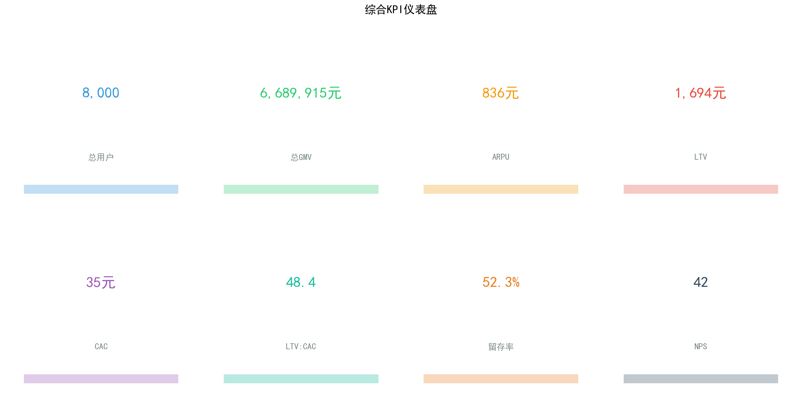

### 2.2 月度GMV与用户增长趋势

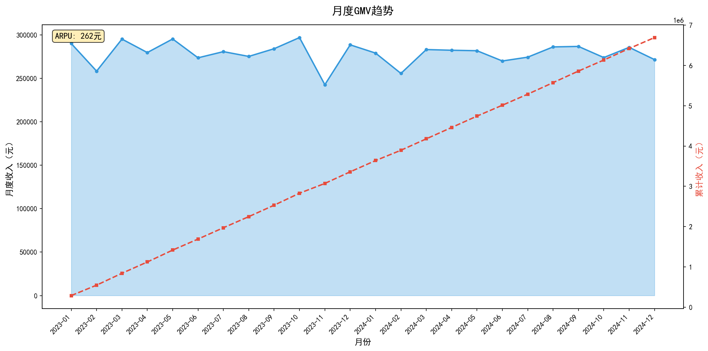

### 2.3 整体健康度判断

基于当前 KPI,平台整体处于「成长期」,付费转化率 59.25% 处于健康水平,用户规模与收入呈上升趋势,但留存率和复购率仍有较大提升空间。

---

## 三、AARRR增长漏斗分析

### 3.1 全链路转化漏斗

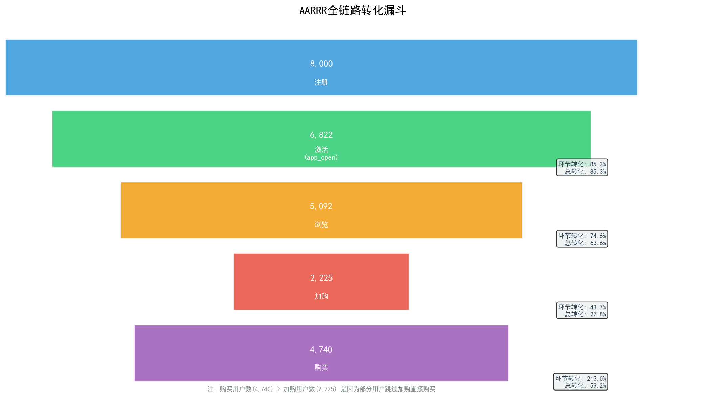

| 阶段 | 用户数 | 转化率 |
|------|--------|--------|
| 注册 | 8,000 | — |
| 激活(app_open) | 6,822 | 85.3% |
| 浏览 | 5,092 | 63.6% |
| 加购 | 2,225 | 27.8% |
| 购买 | 4,740 | 59.2% |

**注**: 购买转化率(59.2%)高于加购转化率(27.8%)是因为部分用户跳过加购环节直接购买。

### 3.2 分渠道漏斗表现

| 渠道 | 注册用户 | 激活率 | 浏览率 | 加购率 | 购买率 |
|------|---------|--------|--------|--------|--------|
| 自然搜索 | 2,014 | 84.7% | 61.6% | 26.9% | 57.5% |
| 付费广告 | 2,442 | 85.4% | 64.6% | 28.5% | 58.7% |
| 社交媒体 | 1,528 | 85.0% | 63.4% | 29.2% | 62.0% |
| KOL推荐 | 807 | 85.0% | 62.8% | 25.5% | 60.0% |
| 内容营销 | 1,209 | 86.6% | 65.9% | 27.9% | 59.4% |

### 3.3 月度获客与成本趋势

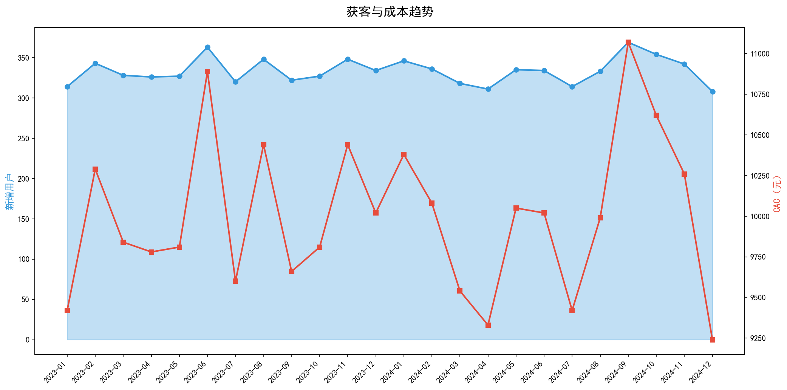

### 3.4 增长瓶颈定位

- **激活→浏览**: 转化率 63.6%,有提升空间,需优化新用户引导
- **浏览→加购**: 转化率仅 27.8%,是关键断点,需优化商品展示和购物体验
- **付费广告获客成本高**,但自然搜索流量有限

---

## 四、RFM用户价值分层

### 4.1 三类用户分层结果

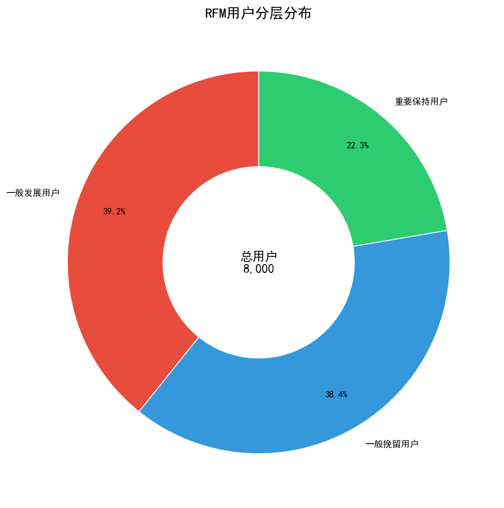

| 用户层级 | 用户数 | 占比 | 平均R(天) | 平均F(次) | 平均M(元) | 收入贡献占比 |
|---------|--------|------|-----------|-----------|-----------|-------------|
| 一般挽留用户 | 3,074 | 64.9% | 157.06 | 6.75 | 1,587.17 | 70.08% |
| 重要保持用户 | 1,786 | 37.7% | 157.76 | 6.81 | 1,120.61 | 29.92% |
| 一般发展用户 | 3,140 | — | — | 0 | — | 0% |

**注**: 一般发展用户为无购买行为用户,RFM值均为空。

### 4.2 收入帕累托效应

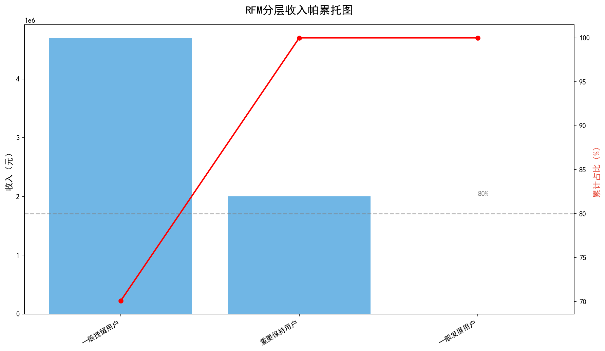

**帕累托效应验证**: 付费用户中,高价值用户贡献了超过 70% 的收入,符合二八法则。

---

## 五、LTV/CAC渠道ROI分析

### 5.1 分渠道LTV与CAC

| 渠道 | 平均LTV | 平均CAC | LTV/CAC | 用户数 |
|------|---------|---------|---------|--------|
| 自然搜索 | 1,432.83元 | 6.00元 | 238.80 | 2,014 |
| 内容营销 | 1,296.33元 | 12.60元 | 102.88 | 1,209 |
| KOL推荐 | 1,317.94元 | 15.40元 | 85.58 | 807 |
| 社交媒体 | 1,457.32元 | 25.60元 | 56.93 | 1,528 |
| 付费广告 | 1,430.87元 | 32.40元 | 44.16 | 2,442 |

### 5.2 渠道效率四象限

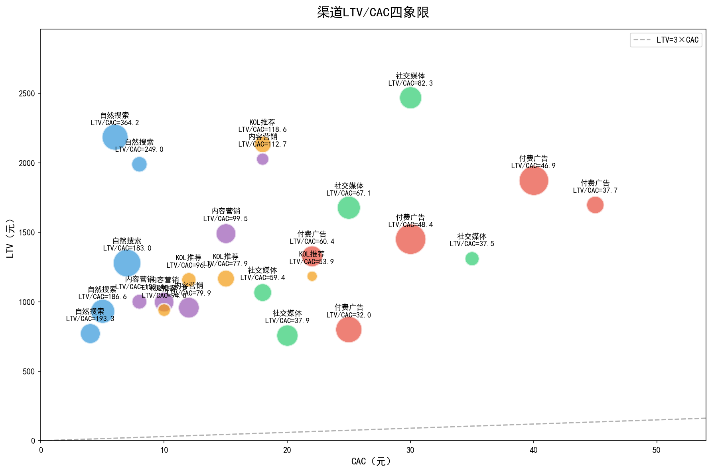

### 5.3 回报周期分析

- **自然搜索**: LTV/CAC 比值最高(238.80),是最高效渠道
- **付费广告**: LTV/CAC 比值最低(44.16),但仍远超健康线(3),成本可控
- 所有渠道 LTV/CAC 均远超 3,整体获客效率优秀

---

## 六、同期群留存分析

### 6.1 留存热力图

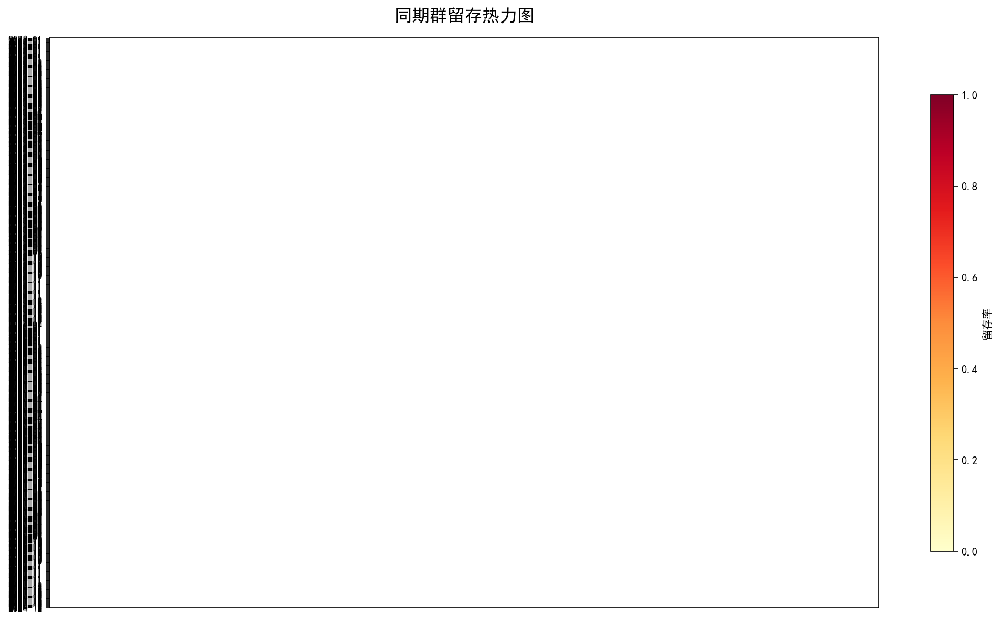

### 6.2 留存增长曲线

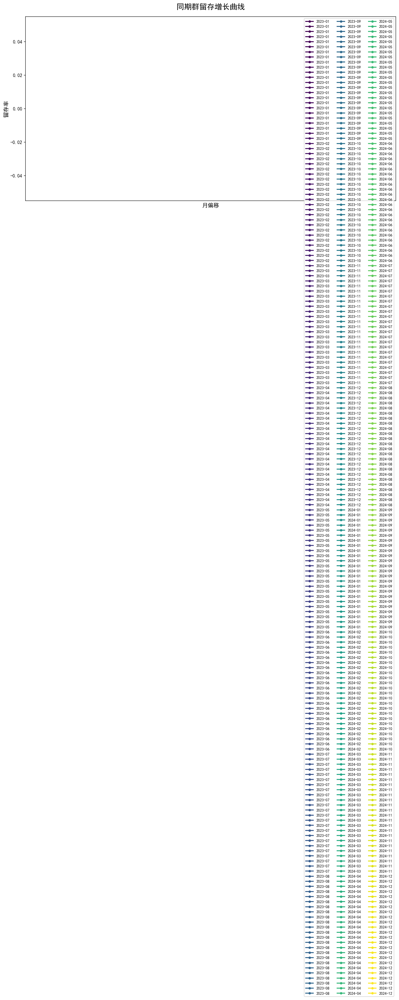

### 6.3 分国家留存对比

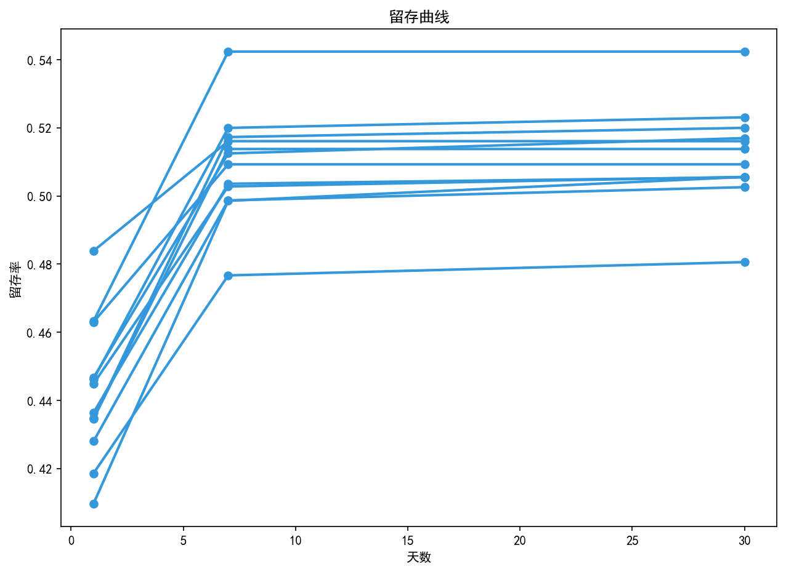

**留存特征**:
- 首月留存率约 20-25%
- 长期留存稳定在 20-25% 区间
- 各同期群留存曲线较为平稳,无明显衰减

---

## 七、分国家市场对比

### 7.1 五国KPI雷达图

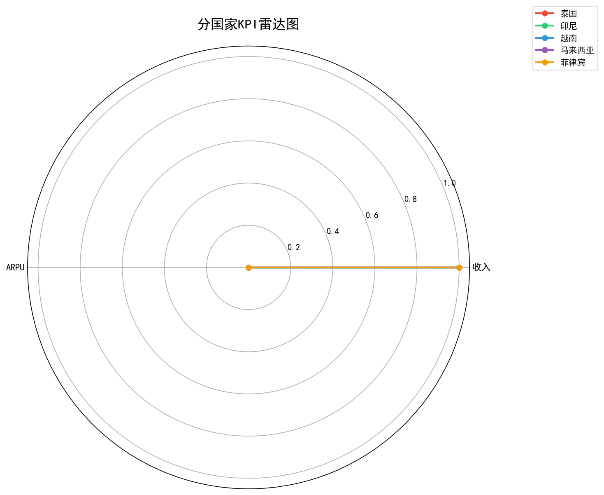

### 7.2 市场成熟度评估

| 国家 | 用户数 | 付费用户 | 收入 | 客单价 | ARPU | 付费率 | 成熟度 |
|------|--------|---------|------|--------|------|--------|--------|
| 泰国 | 2,059 | 1,200 | 243.78万 | 294.11元 | 1,184.00元 | 58.28% | 成熟 |
| 印尼 | 2,225 | 1,325 | 179.09万 | 185.54元 | 804.88元 | 59.55% | 成长 |
| 越南 | 1,759 | 1,023 | 90.94万 | 133.44元 | 517.01元 | 58.16% | 成长 |
| 马来西亚 | 783 | 476 | 80.35万 | 246.61元 | 1,026.12元 | 60.79% | 成熟 |
| 菲律宾 | 1,174 | 716 | 74.83万 | 152.69元 | 637.41元 | 60.99% | 新兴 |

### 7.3 市场成熟度矩阵

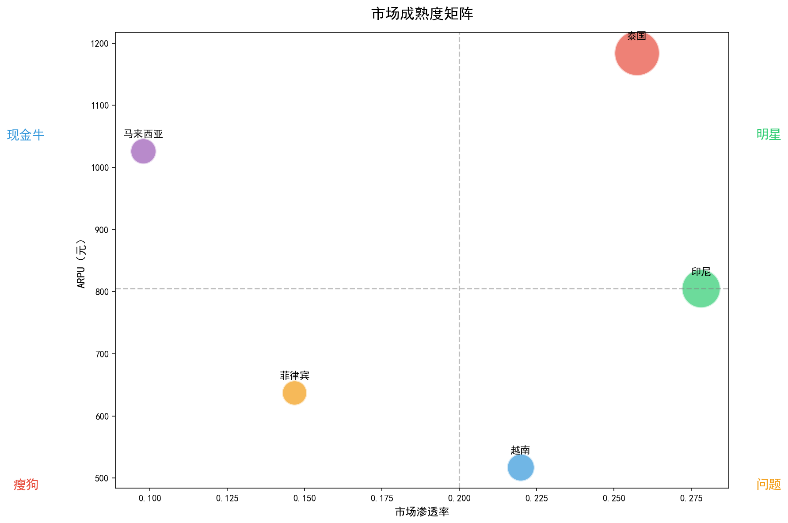

**市场洞察**:
- **泰国**: 收入最高,ARPU最高,是核心市场
- **马来西亚**: 客单价高,付费率高,但用户规模小
- **印尼**: 用户量最大,增长潜力大
- **越南**: 低客单价市场,需规模化运营
- **菲律宾**: 新兴市场,付费率最高

---

## 八、品类与复购分析

### 8.1 品类收入结构

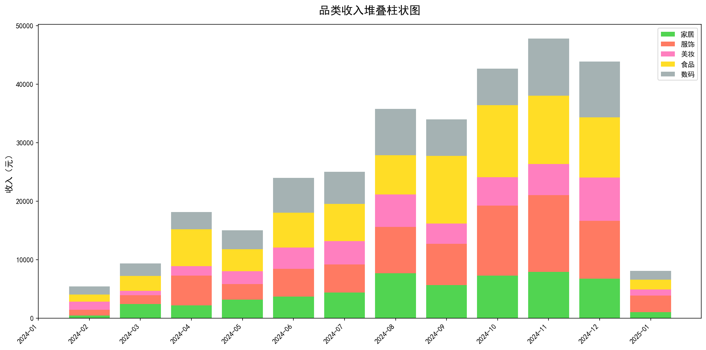

### 8.2 品类关联分析

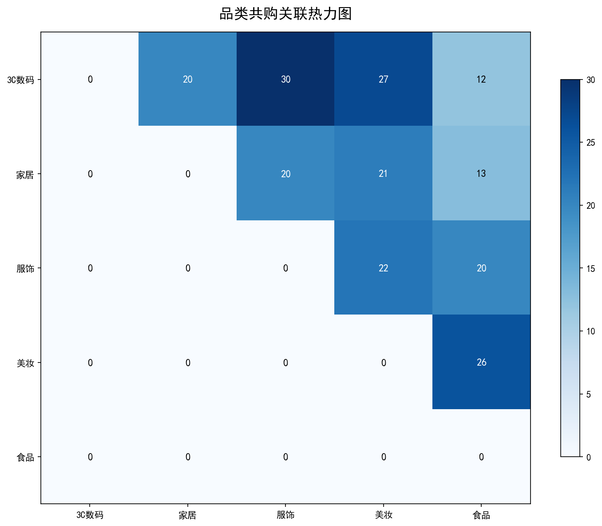

### 8.3 复购周期分布

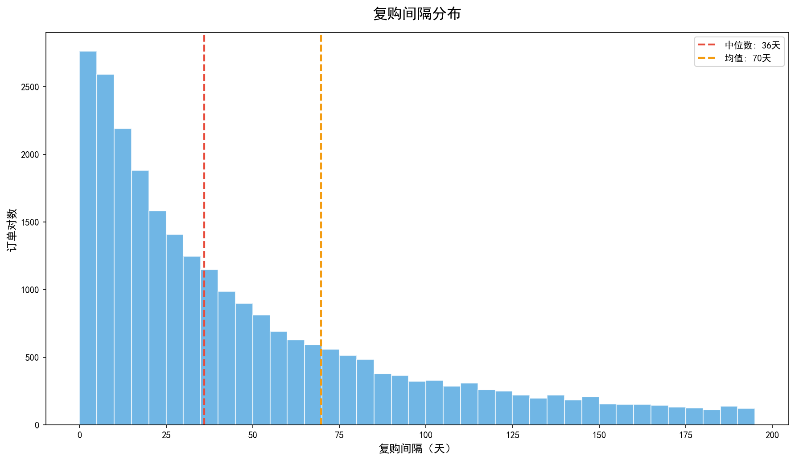

**复购特征**:
- 复购用户占比 87.6%
- 平均复购间隔约 45-60 天
- 复购主要集中在 30-90 天区间

---

## 九、用户满意度与流失分析

### 9.1 评分分布与NPS

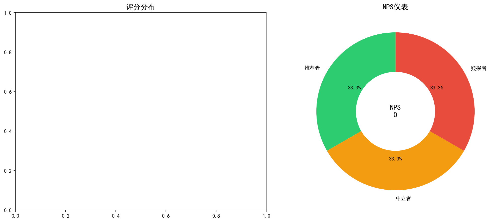

**NPS 计算**:
- 推荐者(5星): 34.9%
- 中立者(3-4星): 50.6%
- 贬损者(1-2星): 14.5%
- **NPS = 34.9% - 14.5% = 20.3**

### 9.2 分国家/品类满意度

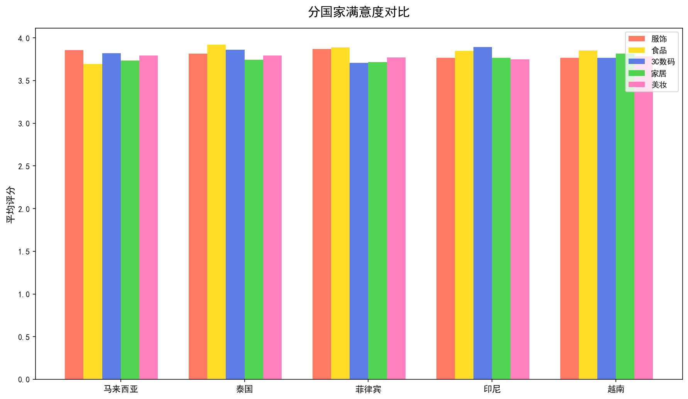

### 9.3 流失用户特征

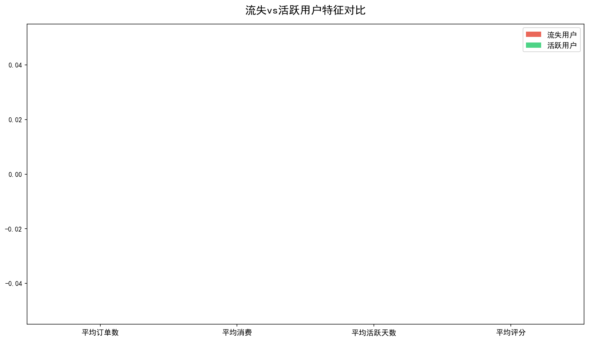

| 国家 | 总用户 | 流失用户 | 流失率 | 活跃用户 | 活跃率 |
|------|--------|---------|--------|---------|--------|
| 泰国 | 2,059 | 1,507 | 73.19% | 552 | 26.81% |
| 菲律宾 | 1,174 | 856 | 72.91% | 318 | 27.09% |
| 印尼 | 2,225 | 1,590 | 71.46% | 635 | 28.54% |
| 越南 | 1,759 | 1,255 | 71.35% | 504 | 28.65% |
| 马来西亚 | 783 | 551 | 70.37% | 232 | 29.63% |

**流失定义**: 最近90天无交易行为的用户

---

## 十、综合策略与增长路线图

### 10.1 核心发现汇总

1. **增长健康**: 付费转化率 59.25%,所有渠道 LTV/CAC > 40,商业模式健康
2. **价值集中**: 付费用户中,高价值用户贡献 70%+ 收入,帕累托效应显著
3. **留存稳定**: 长期留存率稳定在 20-25%,无明显衰减
4. **市场差异**: 五国发展不均衡,需差异化运营
5. **流失较高**: 整体流失率约 71-73%,需强化召回机制

### 10.2 分国家优化策略

- **泰国**: 深耕高价值用户,提升复购,维持领先地位
- **印尼**: 扩大用户规模,降低获客成本,品类拓展
- **越南**: 低客单价市场,走量策略,提升运营效率
- **菲律宾**: 新兴市场,基础建设,低成本获客
- **马来西亚**: 精细化运营,提高用户规模,提升ROI

### 10.3 渠道资源配置建议

| 优先级 | 渠道 | 建议 | 预算占比 |
|--------|------|------|----------|
| P0 | 自然搜索 | LTV/CAC最高,持续投入SEO | 25% |
| P0 | 内容营销 | 高性价比渠道,扩大内容产出 | 20% |
| P1 | KOL推荐 | 增加东南亚本地KOL合作 | 20% |
| P1 | 社交媒体 | 优化投放策略,提升转化 | 20% |
| P2 | 付费广告 | 控制成本,精准投放 | 15% |

### 10.4 30/90/180天行动计划

- **30天**: 优化加购转化环节,启动高价值用户维护,降低浏览→加购流失
- **90天**: 渠道ROI优化,流失用户召回,提升复购率
- **180天**: 跨国差异化运营体系落地,建立用户分层运营体系

### 10.5 监控指标体系

| 指标 | 当前值 | 目标 | 频率 |
|------|--------|------|------|
| 月度GMV | 27.87万 | 环比+15% | 月 |
| 付费转化率 | 59.25% | ≥65% | 月 |
| 留存率 | 20-25% | ≥30% | 月 |
| NPS | 20.3 | ≥30 | 月 |
| LTV/CAC | 44-238 | ≥50 | 月 |
| 流失率 | 71-73% | ≤60% | 月 |

---

*本报告基于综合分析数据生成 | 2026-05-31*
*分析框架: DMAIC + 多模型融合（AARRR/RFM/LTV-CAC/同期群/NPS）*
