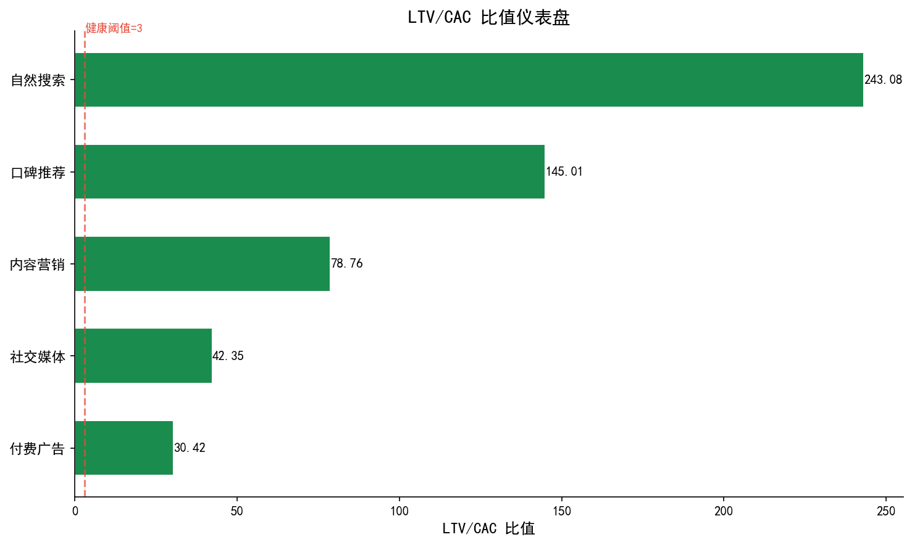
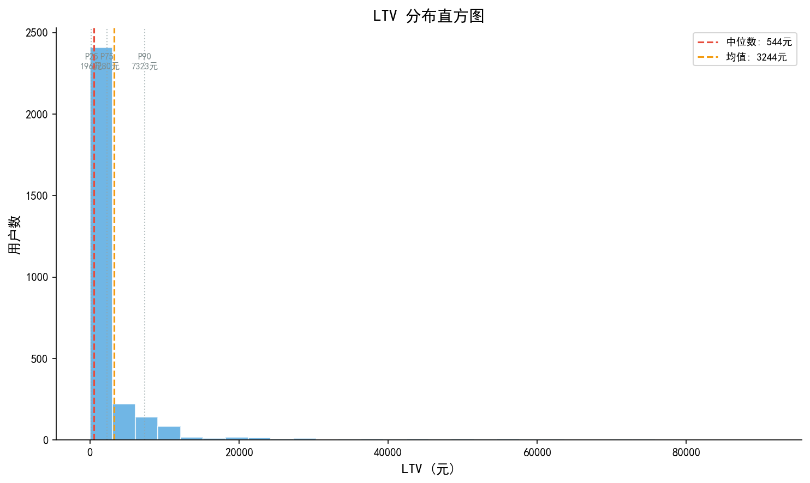
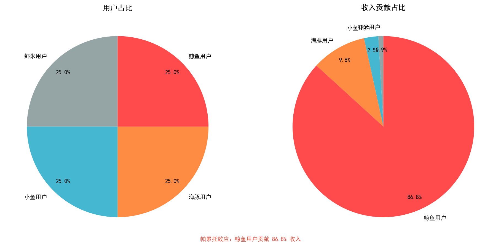
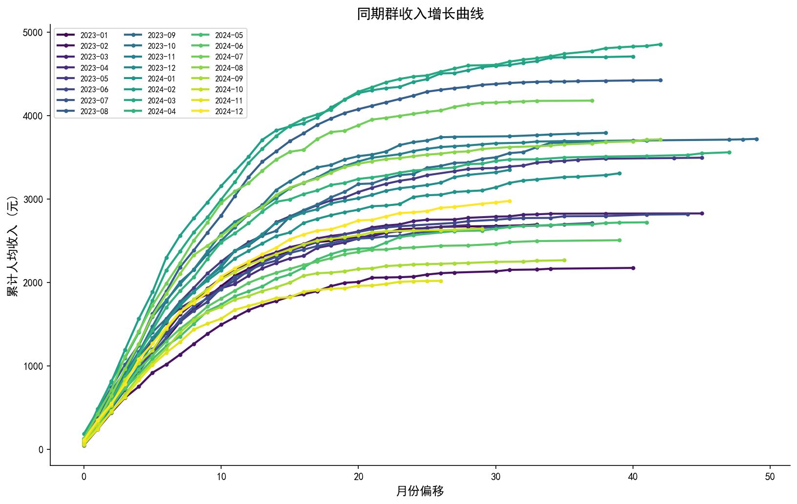
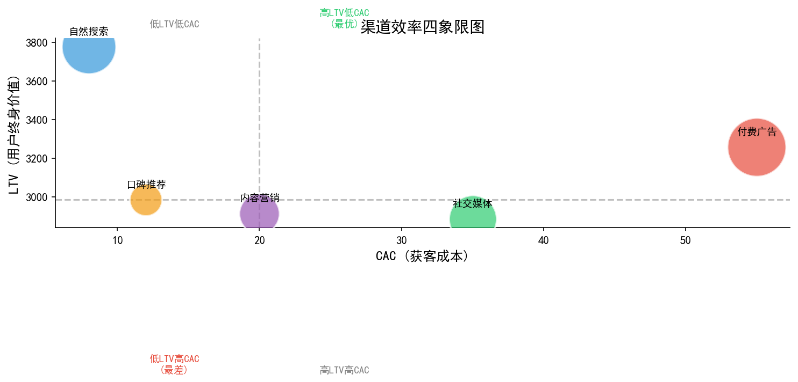
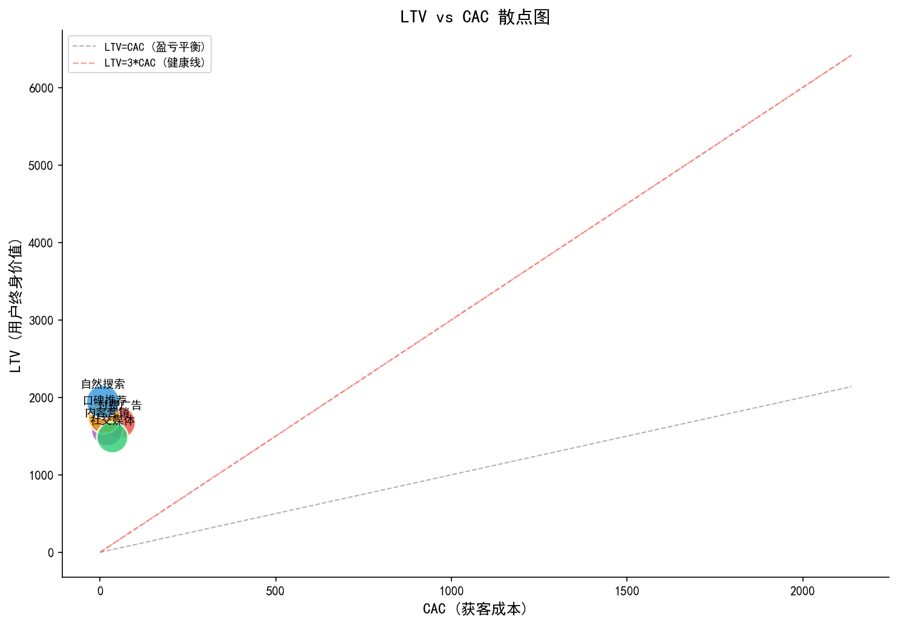
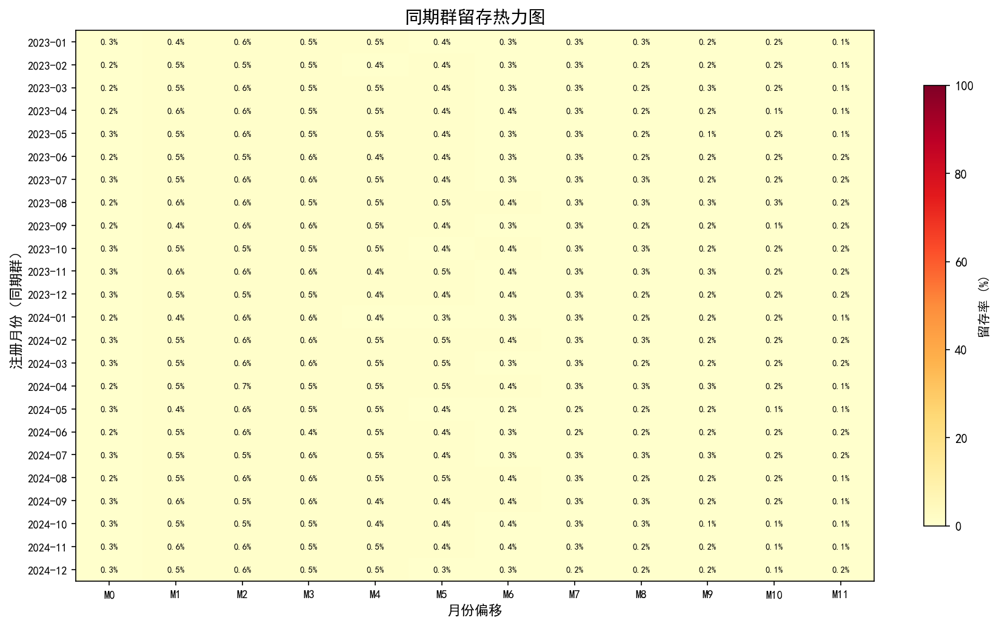
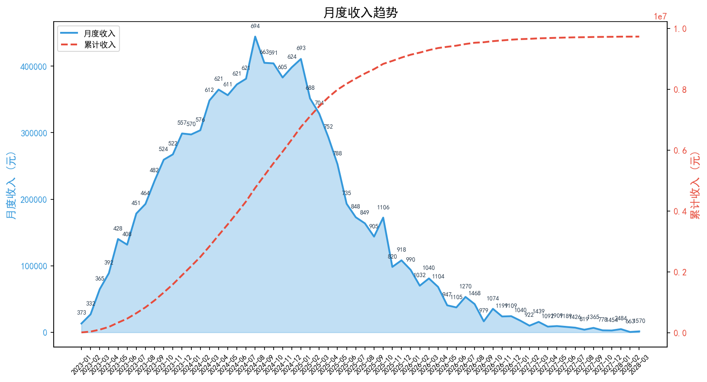
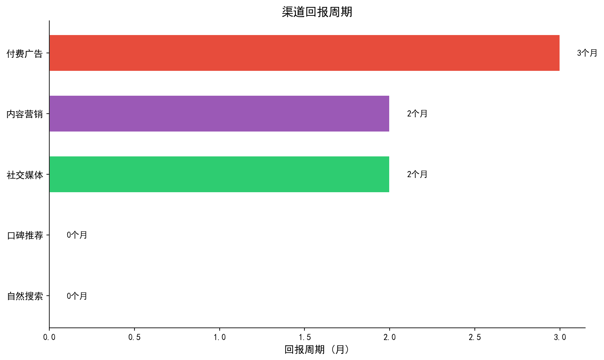
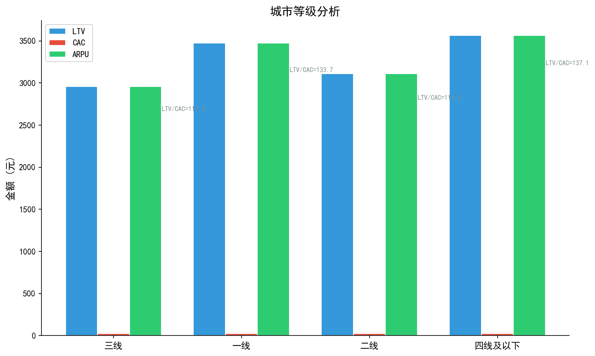

# 用户生命周期价值（LTV/CAC）分析报告

> 分析周期: 2023-01 至 2024-12
> 分析日期: 2026-05-16
> 分析方法: LTV/CAC 模型 + 同期群分析
> 数据规模: 3000 用户 / 20439 订单 / 405,459,360元

## 一、分析背景与目的

### 1.1 业务背景

LTV（用户生命周期价值）与 CAC（获客成本）是衡量商业模式健康度的核心指标。
LTV 回答「每个用户到底值多少钱」，CAC 回答「获取一个用户要花多少钱」，
两者的比值 LTV/CAC 则直接反映商业模式的可持续性：
比值大于3表示健康，大于5表示优秀，小于1则意味着入不敷出。

### 1.2 分析目的

1. 评估当前用户群体的商业价值
2. 识别获客成本效率最高的渠道
3. 判断商业模式健康度
4. 为渠道投放和用户运营提供数据支撑

### 1.3 核心指标定义

| 指标 | 定义 | 计算公式 |
|------|------|----------|
| LTV | 用户生命周期价值 | ARPU × 平均生命周期 |
| CAC | 获客成本 | 总获客成本 / 新用户数 |
| ARPU | 每用户平均收入 | 总收入 / 用户数 |
| 回报周期 | 收回获客成本所需时间 | CAC / 月ARPU |
| 毛利率 | 收入中扣除成本后的比例 | (收入-成本)/收入 |

## 二、核心指标概览

### 2.1 关键指标汇总表

| 指标 | 数值 | 行业基准 | 判断 |
|------|------|----------|------|
| LTV | 135153元 | - | - |
| CAC | 28元 | - | - |
| LTV/CAC | 4914.7 | >3 | 健康 |
| ARPU | 135153元 | - | - |
| 回报周期 | 0.0月 | <12月 | 健康 |

### 2.2 LTV/CAC 比值判断

LTV/CAC 比值为 4914.7，大于3，表明商业模式健康。

## 三、LTV 深度分析

### 3.1 LTV 分布

LTV 的分布呈现长尾特征，少量高价值用户贡献了大部分收入。

### 3.2 用户价值分层

用户可划分为四个价值层级：
- 鲸鱼用户：LTV 最高的头部用户
- 海豚用户：中高价值用户
- 小鱼用户：中等价值用户
- 虾米用户：低价值用户

### 3.3 同期群收入增长

不同注册月份的同期群收入增长趋势，反映用户生命周期内的价值积累。

## 四、CAC 分析

### 4.1 渠道获客成本

### 4.2 渠道 LTV vs CAC

## 五、同期群留存分析

### 5.1 留存热力图

同期群留存热力图展示了不同月份注册用户的留存率分布。

### 5.2 留存率衰减趋势

留存率随时间呈现指数衰减，首月留存率是关键指标。

## 六、收入与回报分析

### 6.1 月度收入趋势

### 6.2 回报周期分析

### 6.3 城市等级分析

## 七、综合评估与建议

### 7.1 商业模式健康度评分

基于 LTV/CAC 比值和回报周期，综合评估商业模式健康度。

### 7.2 渠道优化建议

- 优先投放 LTV/CAC 最优渠道
- 逐步淘汰 CAC 过高渠道
- 关注渠道用户质量差异

### 7.3 LTV 提升策略

- 提升复购率
- 增加客单价
- 延长用户生命周期

### 7.4 CAC 优化策略

- 优化投放渠道组合
- 提升自然流量占比
- 降低单用户获客成本

## 八、总结

### 8.1 核心发现

- LTV/CAC 比值为 4914.7，商业模式健康
- ARPU 为 135153元，回报周期约 0.0 月
- 渠道效率差异显著，需针对性优化

### 8.2 行动优先级

1. 优化渠道投放策略
2. 提升高价值用户占比
3. 缩短回报周期

### 8.3 后续分析建议

- 结合 RFM 分层深化 LTV 分析
- 引入预测模型估算未来 LTV
- 进行多维度归因分析
