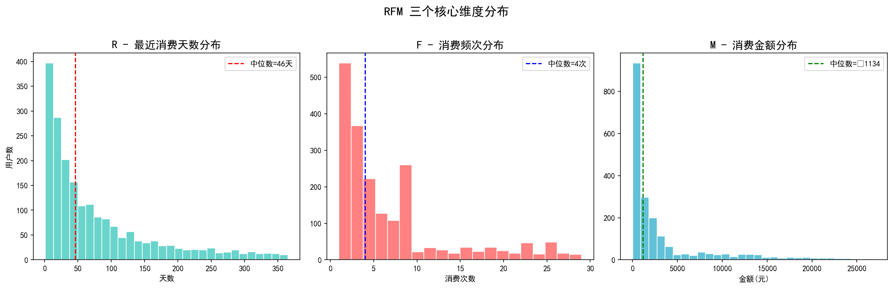
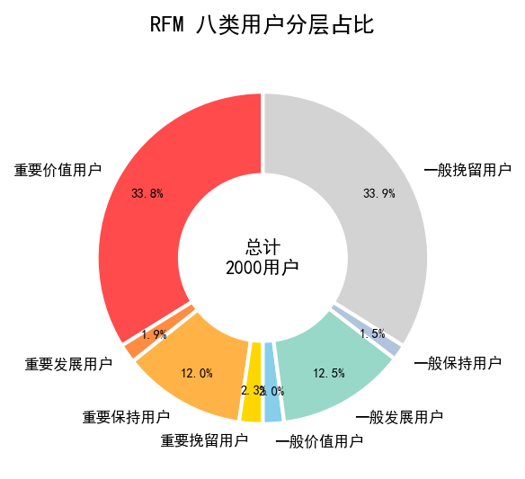
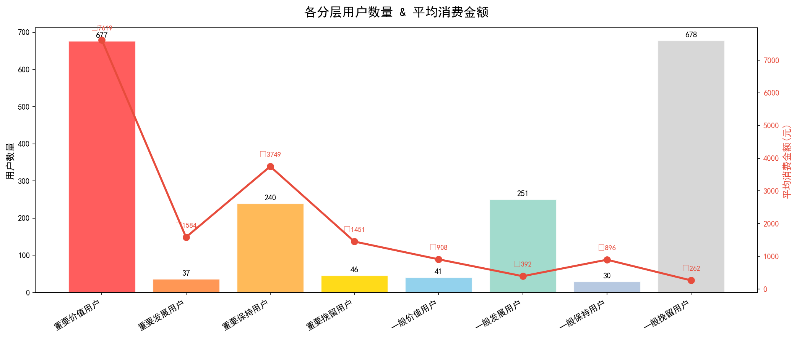
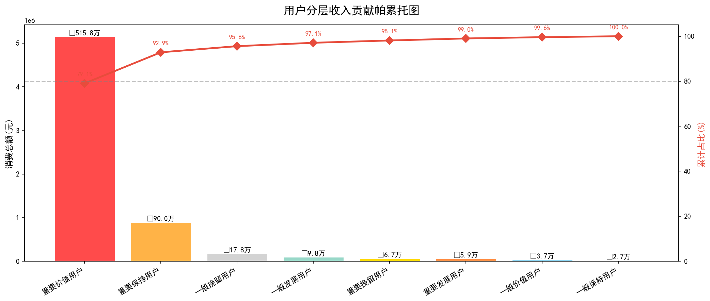
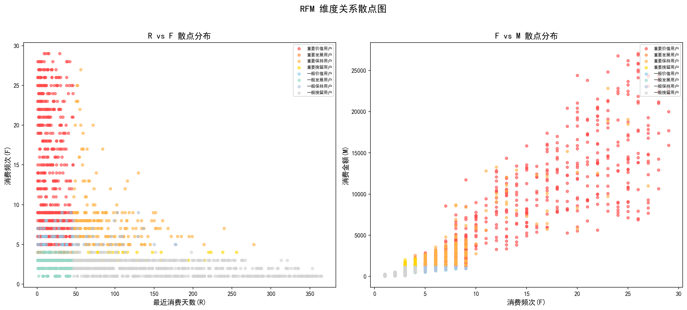
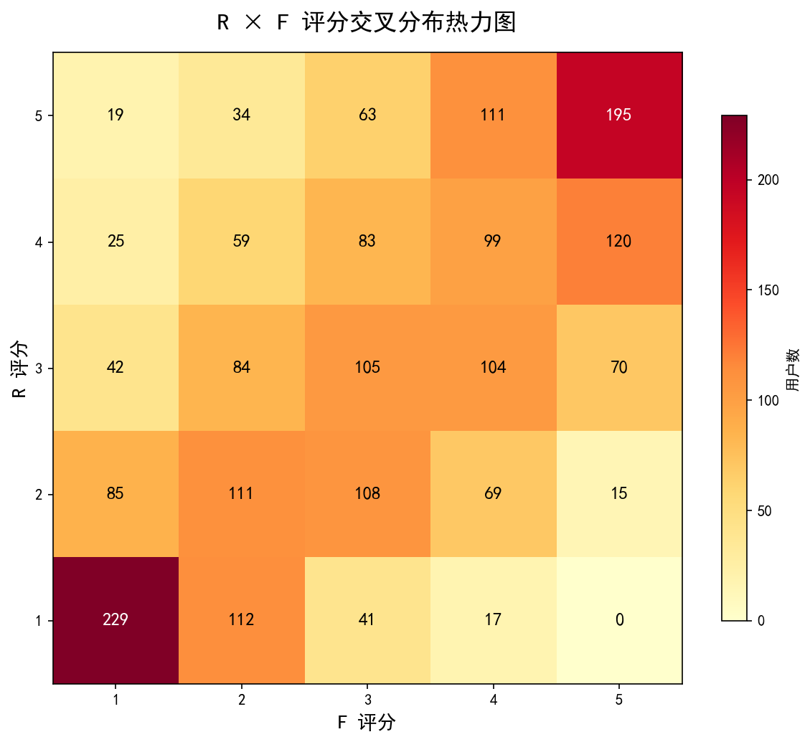
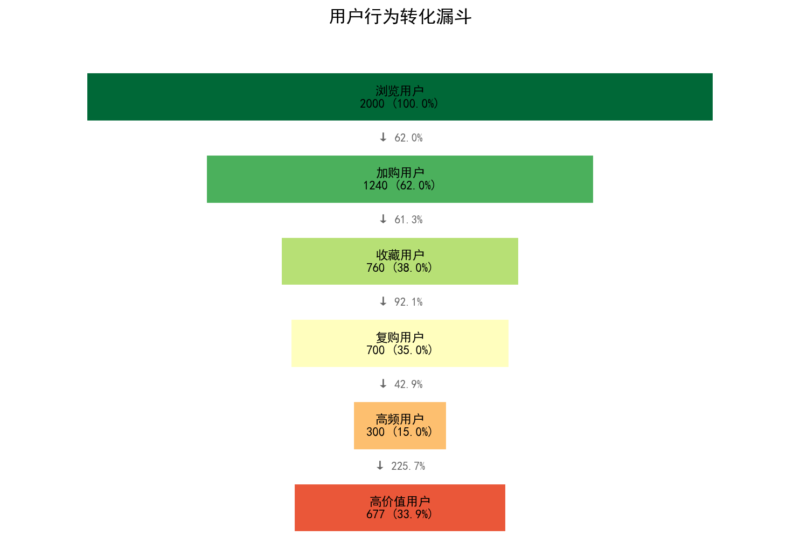
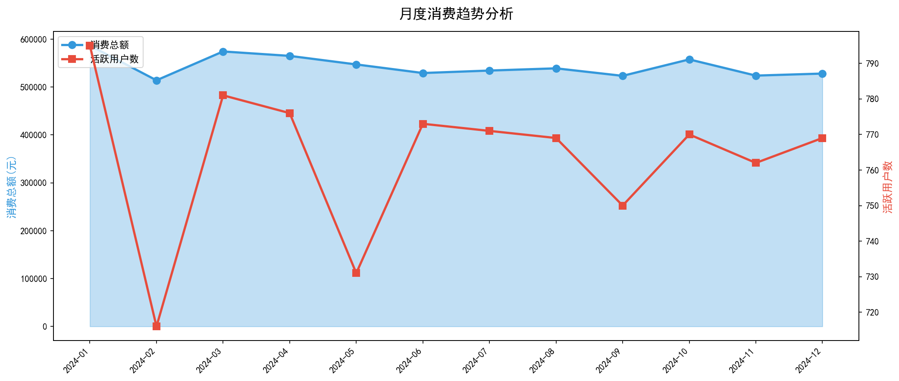

# 电商用户 RFM 价值分层分析报告

> **分析周期**: 2024-01-01 至 2024-12-31
> **分析日期**: 2026-05-15
> **分析方法**: RFM 模型 (Recency-Frequency-Monetary)
> **数据规模**: 2,000 用户 / 14,066 笔订单 / ¥6,523,671.51 总交易额

---

## 一、分析背景与目的

### 1.1 业务背景

在电商业务中，用户价值差异巨大。根据帕累托法则，20% 的用户往往贡献 80% 的收入。精准识别用户价值层级，是制定差异化运营策略的前提。

### 1.2 分析目的

1. **用户分层**：基于 RFM 模型将用户划分为 8 个价值层级
2. **识别核心用户**：找出高价值用户群体及其行为特征
3. **流失预警**：识别有流失风险的高价值用户
4. **策略建议**：为每类用户制定差异化运营方案

### 1.3 分析框架

```
RFM 模型三维度:
├── R (Recency)  → 最近一次消费距今天数  → 衡量用户活跃度
├── F (Frequency) → 消费频次             → 衡量用户忠诚度
└── M (Monetary)  → 累计消费金额         → 衡量用户贡献度
```

---

## 二、数据概览

### 2.1 核心指标

| 指标 | 数值 |
|------|------|
| 总用户数 | 2,000 |
| 总订单数 | 14,066 |
| 总交易额 | ¥6,523,671.51 |
| 平均客单价 | ¥463.79 |
| 人均消费 | ¥3,261.84 |
| 人均订单数 | 7.0 |

### 2.2 RFM 维度统计

| 统计量 | R(天) | F(次) | M(元) |
|--------|-------|-------|-------|
| 均值 | 79.0 | 6.9 | 3261.8 |
| 中位数 | 46.0 | 4.0 | 1134.2 |
| 标准差 | 84.3 | 6.7 | 5144.4 |
| 最小值 | 1 | 1 | 16.33 |
| 最大值 | 365 | 29 | 27055.19 |



**关键发现**：
- R 维度呈**右偏分布**，大量用户集中在近期消费区间，但存在长尾（部分用户长期未活跃）
- F 维度呈**指数衰减**，低频用户占比高，高频用户稀缺
- M 维度呈**显著右偏**，少数用户贡献了绝大部分收入

---

## 三、RFM 用户分层结果

### 3.1 分层方法

采用**中位数切分法**，按 R、F、M 各维度中位数划分高/低两组，组合得到 8 类用户：

| 维度 | 阈值 | 高值标准 | 低值标准 |
|------|------|---------|---------|
| R | 46天 | ≤46天 (近期消费) | >46天 (久未消费) |
| F | 4次 | >4次 (高频消费) | ≤4次 (低频消费) |
| M | ¥1134 | >¥1134 (高消费) | ≤¥1134 (低消费) |

### 3.2 八类用户全景图



### 3.3 各层用户详细数据

| 用户层级 | 用户数 | 占比 | 平均R(天) | 平均F(次) | 平均M(元) | 总消费(元) | 收入贡献占比 |
|---------|--------|------|-----------|-----------|-----------|-----------|-------------|
| 重要价值用户 | 677 | 33.9% | 17.7 | 13.3 | 7619 | 5158106 | 79.1% |
| 重要发展用户 | 37 | 1.8% | 23.6 | 3.8 | 1584 | 58619 | 0.9% |
| 重要保持用户 | 240 | 12.0% | 85.2 | 8.3 | 3749 | 899842 | 13.8% |
| 重要挽留用户 | 46 | 2.3% | 107.4 | 3.6 | 1451 | 66760 | 1.0% |
| 一般价值用户 | 41 | 2.1% | 22.4 | 6.2 | 908 | 37230 | 0.6% |
| 一般发展用户 | 251 | 12.6% | 23.0 | 2.6 | 392 | 98312 | 1.5% |
| 一般保持用户 | 30 | 1.5% | 90.2 | 6.0 | 896 | 26877 | 0.4% |
| 一般挽留用户 | 678 | 33.9% | 162.9 | 2.0 | 262 | 177926 | 2.7% |



### 3.4 收入贡献帕累托分析



**帕累托效应验证**：
- **重要价值用户** 占用户总数的 **33.9%**，却贡献了 **79.1%** 的收入
- 前 2 类重要用户（重要价值 + 重要保持）合计占比 **45.9%**，贡献收入 **92.9%**

---

## 四、用户行为深度分析

### 4.1 RFM 维度相关性



**发现**：
- F 与 M 呈**强正相关**：高频用户往往也是高消费用户
- R 与 F 呈**负相关**：近期活跃的用户通常消费频次更高
- 重要价值用户聚集在「低R、高F、高M」区域，特征明显

### 4.2 RFM 评分交叉分布



**解读**：热力图展示了 R 评分与 F 评分的交叉分布，颜色越深代表该区域用户越密集。

### 4.3 用户行为漏斗



**漏斗分析**：
- 浏览→加购转化率 62.0%，表现良好
- 加购→收藏转化率 61.3%，存在提升空间
- 加购→购买转化率 56.5%，是核心优化环节
- 高价值用户仅占 33.9%，说明用户价值提升空间大

### 4.4 月度消费趋势



---

## 五、Top 10 高价值用户

| 排名 | 用户ID | R(天) | F(次) | M(元) | R分 | F分 | M分 |
|------|--------|-------|-------|-------|-----|-----|-----|
| 1 | U00386 | 28 | 26 | ¥27,055.19 | 4 | 5 | 5 |
| 2 | U01628 | 25 | 26 | ¥26,890.31 | 4 | 5 | 5 |
| 3 | U00001 | 5 | 24 | ¥26,785.64 | 5 | 5 | 5 |
| 4 | U00413 | 4 | 25 | ¥26,204.81 | 5 | 5 | 5 |
| 5 | U01741 | 4 | 26 | ¥25,891.68 | 5 | 5 | 5 |
| 6 | U01620 | 19 | 26 | ¥25,797.45 | 4 | 5 | 5 |
| 7 | U01215 | 26 | 25 | ¥25,695.06 | 4 | 5 | 5 |
| 8 | U01971 | 11 | 26 | ¥25,089.04 | 5 | 5 | 5 |
| 9 | U00141 | 38 | 26 | ¥24,878.69 | 3 | 5 | 5 |
| 10 | U01455 | 1 | 23 | ¥24,815.16 | 5 | 5 | 5 |

---

## 六、运营策略建议

### 6.1 差异化运营方案

#### 重要价值用户（VIP 维护）
- **策略**：专属客服、优先体验新品、会员积分加倍
- **目标**：维持忠诚度，提升 LTV
- **预算占比**：40%

#### 重要发展用户（提频次）
- **策略**：组合推荐、满减活动引导多次购买
- **目标**：提升消费频次 → 转化为重要价值用户
- **预算占比**：15%

#### 重要保持用户（召回）
- **策略**：个性化 Push、专属优惠券、生日关怀
- **目标**：缩短消费间隔，唤醒沉睡用户
- **预算占比**：20%

#### 重要挽留用户（流失预警）
- **策略**：大额优惠券、问卷调研流失原因
- **目标**：挽回高价值流失用户
- **预算占比**：15%

#### 一般用户（基础运营）
- **策略**：标准化促销、内容运营
- **目标**：筛选潜力用户向上转化
- **预算占比**：10%

### 6.2 核心关注指标

| 优先级 | 指标 | 当前值 | 目标 |
|--------|------|--------|------|
| P0 | 重要价值用户占比 | 33.9% | ≥25% |
| P0 | 重要保持用户召回率 | - | ≥30% |
| P1 | 整体复购率 | 86.6% | ≥60% |
| P1 | 用户平均消费金额 | ¥3262 | 提升20% |
| P2 | 月活跃用户数 | - | 环比增长5% |

---

## 七、总结

### 7.1 核心发现

1. **二八效应显著**：33.9% 的重要价值用户贡献了 79.1% 的收入
2. **流失风险**：重要保持用户 (240人) 消费力强但近期不活跃，需重点召回
3. **增长机会**：重要发展用户 (37人) 消费金额高但频次低，有较大提升空间
4. **长尾用户**：一般挽留用户占比 33.9%，需评估投入产出比

### 7.2 行动优先级

```
紧急且重要: 重要保持用户召回 → 防止高价值用户流失
重要不紧急: 重要发展用户提频 → 培养下一批 VIP
紧急不重要: 重要挽留用户触达 → 尝试低成本挽回
日常运营: 一般用户分层筛选 → 找到潜力用户
```

### 7.3 后续分析建议

1. 结合用户行为数据（浏览、加购、搜索），丰富用户画像
2. 建立流失预测模型，提前识别潜在流失用户
3. 设计 A/B 测试验证运营策略效果
4. 按月跟踪 RFM 分层变化，评估运营效果

---

*本报告使用 Python + Pandas + Matplotlib 自动生成*
*数据来源: 模拟电商交易数据 | 分析方法: RFM 分层模型*
